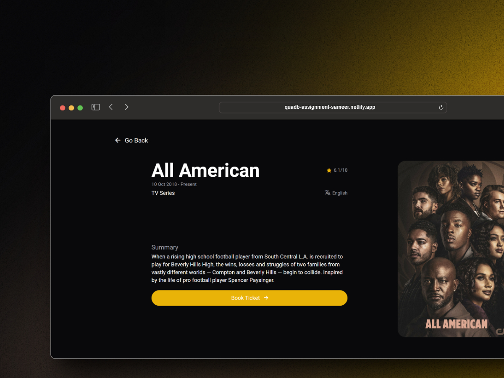
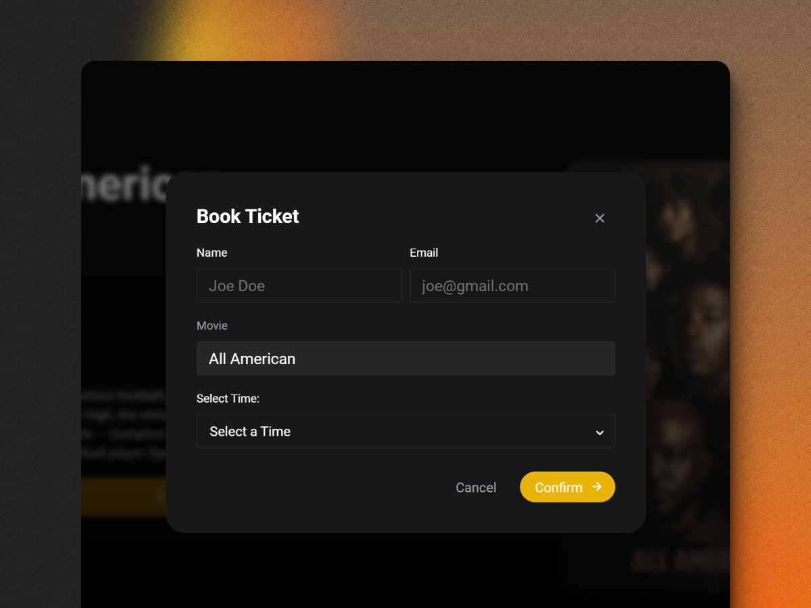
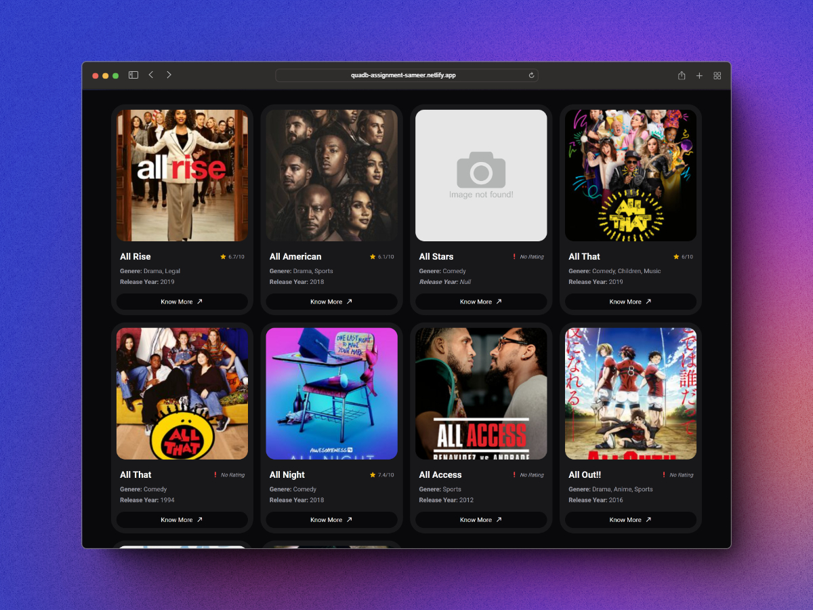
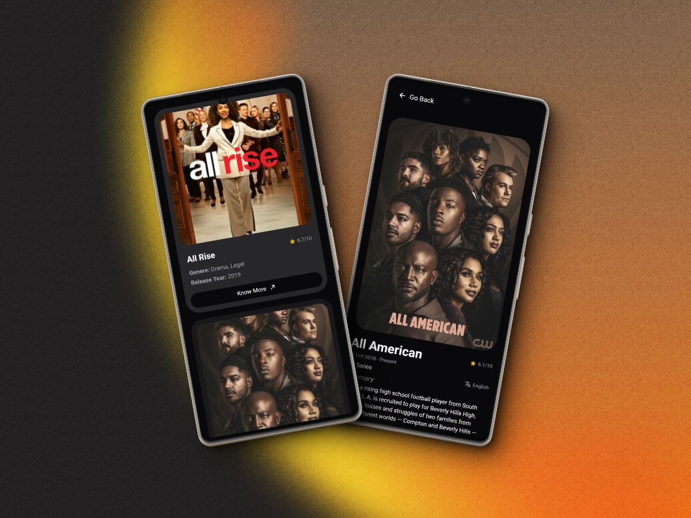
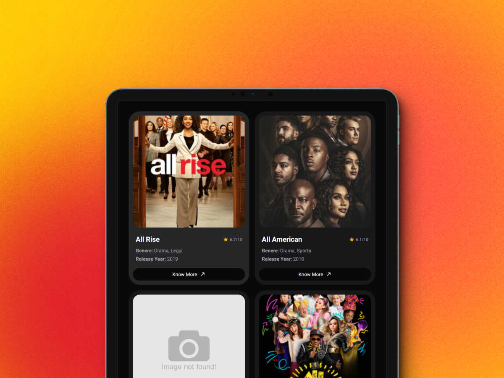

# QuadB React Assignment

## Overview

This project is a React-based application that uses the [TV Maze API](https://api.tvmaze.com/search/shows?q=all) to fetch and display various shows. Here's a quick rundown of the key features:

## Features

1. **Custom React Components:** The project is built with carefully crafted React components, ensuring a clean and organized codebase.

1. **React Router:** Enjoy seamless navigation with two routes - a home page and a summary page.

1. **Booking Form Dialog:** Easily book tickets using a user-friendly dialog with details stored in local storage.

1. **Snackbar Notification:** Receive instant feedback with a snackbar notification upon successful booking.

## Mockups

